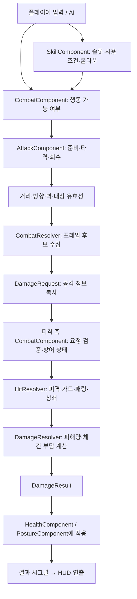

# 공격·스킬·피해 처리 확장 구조

현재 전투는 **공격 실행**, **스킬 사용 관리**, **피해 계산**, **캐릭터 상태 적용**을 분리합니다. 현재는 InGame 범위의 `CombatResolver`가 Hitbox로 수집한 여러 타격 요청을 모으고, 피격 측 `CombatComponent.plan_attack()`과 공통 계산기를 통해 결과를 확정·적용합니다. [다수전 판정과 3명 훈련 가이드](multi-combat-hitboxes.md)를 참고하세요.

플레이 조작과 색별 대응 수치는 [전투 가이드](duel-prototype.md)를 참고하세요.

## 한 번의 공격이 처리되는 과정



공격자는 적의 체력을 직접 변경하지 않습니다. 공격 정보를 전달하면 피격 측이 현재 방어 상태와 저항을 확인하고 공통 계산기의 결과를 적용합니다. 튕김·돌진 패링은 공격자 체간에도 영향을 주므로, 피격 측의 처리 구간에서 양쪽을 함께 잠그고 결과를 적용합니다.

## 클래스별 소유권

| 클래스 | 소유하는 정보 / 역할 |
|---|---|
| `AttackDefinition` | 공격 ID, 대응 종류, 피해 타입, 피해량, 체간 부담, 범위, 동작 시간. 공유 설정 리소스 |
| `AttackComponent` | 현재 공격 설정·준비·타격·회수·방향·조준 보조 대상·대상별 적중 기록·동작 번호 |
| `CombatComponent` | 행동 허용·입력 예약·진영·구역·방어 연결, 피격 요청 검증, 판정 결과 적용 |
| `SkillDefinition` | 스킬 ID·이름·설명·아이콘·공격 리소스·재사용 대기시간 |
| `SkillComponent` | 캐릭터별 보유 스킬, 장착 슬롯 0~7, 스킬 ID별 남은 대기시간 |
| `DamageType` | 일반·참격·타격·관통·화염의 피해 타입 열거형 |
| `DefenseProfile` | 고정 방어력과 피해 타입별 저항의 설정 리소스 |
| `DamageRequest` | 노드 참조가 없는 공격 정보: 공격자·대상·공격 ID, 실행 인스턴스 식별자, 피해·체간 수치 |
| `HitResolver` | 방어 방식에 따른 결과 선택. 상태를 변경하지 않음 |
| `DamageResolver` | 피해와 체간 부담 계산. 노드 접근·상태 변경·시그널 없음 |
| `DamageResult` | 판정 결과, 계산된 체력 피해·양쪽 체간 부담, 실제 적용된 체력 피해 |
| `DamageEvent` | Health에 전달하는 최종 피해와 출처 메타데이터. 기존 생성자 호환 |

`CombatComponent.phase`, `phase_left`, `attack_direction`은 AttackComponent를 읽는 창구입니다. 두 클래스에 공격 상태를 중복 저장하지 않습니다. 기존 `combat.attack` API는 AttackComponent의 기본 공격 리소스에 위임합니다.

## 씬 구성

```text
Character
├─ Health / Guard / Posture / ...
└─ Combat (CombatComponent)
   ├─ Attack (AttackComponent)     필수: 전투 동작 실행
   └─ Skills (SkillComponent)      선택: 스킬을 사용하는 캐릭터
```

플레이어와 훈련 로봇 모두 Attack을 갖습니다. 현재 Skills는 플레이어에만 있습니다. 일반 NPC에게 전투 기능을 강제하지 않습니다. Skills를 제거해도 일반 공격·방어는 유지됩니다.

## 색상과 피해 타입은 서로 독립

- `AttackDefinition.kind`: 일반·푸름·붉음·보라. 막거나 반격하는 방법을 결정합니다.
- `AttackDefinition.damage_type`: 일반·참격·타격·관통·화염. 적용할 피해 저항을 결정합니다.
- `posture_damage`, `guard_posture_damage`, `deflect_posture_damage`: 체력과 별도로 계산하는 체간 부담입니다.

예를 들어 푸른 화염 공격과 푸른 타격 공격은 같은 대응 규칙을 사용하지만 서로 다른 저항이 적용됩니다. 현재 공격 에셋은 타격 타입이며, 기본 방어력·저항은 0이라 기존 전투 피해량은 같습니다.

### 현재 피해 공식

```text
체력 피해 = max(0, 공격 피해 - 고정 방어력) × (1 - 해당 타입 저항)
```

방어력은 현재 모든 피해 타입에 공통 적용됩니다. 저항 0.25는 25% 감소, 1은 체력 피해 면역, -0.5는 50% 취약입니다. 저항 허용 범위는 -1~1입니다. 아직 물리·원소별 별도 방어력이나 공격력 계수·치명타는 없습니다.

예: 참격 피해 30, 방어력 10, 참격 저항 0.25 → 체력 피해 15.

- 일반 가드는 체력 피해 0, 가드 체간 부담만 발생합니다.
- 푸른 일반 가드는 가드 체간 부담 ×3입니다. 정확한 튕김은 공격자 체간 부담으로 전환합니다.
- 돌진 패링은 공격자의 튕김 체간 부담 ×2입니다.
- 회피·상쇄는 양쪽 체력·체간 피해 0입니다.
- **체력 피해가 방어력·저항 때문에 0이어도 적중 체간 부담은 유지합니다.** Health의 명시적 무적은 접촉 자격 검사에서 전체 공격을 거부합니다.
- 적 체간 붕괴 후 기본 공격으로 하는 제압은 명시적 `execution` 요청입니다. 피격 측이 제압 가능·붕괴 상태를 다시 확인하고, 방어력·저항을 우회해 남은 체력만큼 적용합니다.
- NaN·무한대·음수 피해, 잘못된 저항·타입은 계산에서 거부합니다. 피해가 음수가 되어 회복되는 경우는 없습니다.

## 공격·피격 요청의 계약

1. AttackComponent는 공격을 시작할 때 설정을 복사합니다. 준비 중 원본 리소스를 바꿔도 이미 시작한 공격은 바뀌지 않습니다.
2. 타격 구간에서 `DamageRequest`를 만들며, `emitter_id + sequence`가 해당 실행을 식별합니다. 공격 ID는 콘텐츠 식별자이므로 여러 번 사용해도 같습니다.
3. 피격 측은 구역·진영·Hitbox/Hurtbox 겹침·벽·무적·잠금과 요청의 실행 번호·내용을 재검사합니다. 준비 중 조기 요청, 수정된 피해량, 취소된 실행, 이미 소비한 요청은 거부합니다.
4. 계산 결과가 유효하면 접촉을 소비하고 양쪽의 재진입을 막은 뒤 상태를 적용합니다. 동일 요청을 시그널 콜백에서 다시 제출해도 두 번 적용되지 않습니다.
5. 보라색 상쇄는 양쪽 접촉을 먼저 소비하고 양쪽 회수 상태를 설정한 뒤 시그널을 보냅니다. 취소·초기화는 대기 중인 지연 판정을 무효화합니다.
6. `DamageResult.health_damage`는 계산된 피해, `applied_health`는 실제 체력 감소입니다. 체력이 5 남았을 때 계산 피해가 12여도 적용 피해는 5입니다. 체간 필드는 계산된 부담이며 붕괴·컴포넌트 부재 등에 따라 실제 누적은 제한될 수 있습니다.

요청·결과는 값의 복사본을 사용합니다. `damage_resolved` 시그널에도 내부 결과의 복사본을 전달합니다. 받은 보고 객체는 읽기 전용으로 취급하세요. 순수 계산기는 요청을 계산할 뿐, 중복 적용 방지나 상태 변경을 맡지 않습니다.

기존 `HealthComponent.take_damage(DamageEvent)`는 이미 확정된 피해를 적용하는 낮은 수준 API로 유지합니다. 이 API를 직접 호출하면 방어·저항을 재계산하지 않습니다. 새 전투 공격은 공통 접촉 경로를 사용해야 합니다. 투사체·함정의 접촉 생성기는 아직 이번 구현에 포함하지 않았습니다.

## 스킬 등록과 사용

### 에디터에서 추가

1. `AttackDefinition` 리소스를 만들고 고유 `attack_id`, 대응 종류, 피해 타입, 피해·시간·범위를 설정합니다.
2. `SkillDefinition` 리소스를 만들고 고유 `skill_id`, 이름, 설명, 선택적 아이콘, 공격 리소스, `cooldown_seconds`를 설정합니다.
3. 캐릭터의 `Combat/Skills.initial_skills`에 등록합니다. 배열 순서가 초기 슬롯이며 최대 8개입니다. 중복 ID나 유효하지 않은 초기 설정은 오류로 알립니다.

현재 예시는 [purple_clash.tres](../gd-game-02/data/skills/purple_clash.tres)입니다. Q는 슬롯 0의 `purple_clash`를 사용합니다. 재사용 대기시간은 0초로 기존 상쇄 공방을 유지하고, 공격 동작의 준비·회수 시간은 여전히 적용합니다.

### 코드에서 관리

```gdscript
var skills := combat.skills()
skills.learn(load("res://data/skills/new_skill.tres"))
skills.equip(1, &"new_skill")
combat.request_skill(1) # 동작 회수 끝의 입력 예약도 지원

var id := skills.skill_id(1)
var seconds := skills.remaining(id)
var usable := skills.can_use(1)
```

- `learn()`은 설정을 깊게 복사합니다. 공유 에셋을 런타임 상태 저장소로 사용하지 않습니다.
- `definition(id)`는 UI 조회용 복사본을 반환합니다. 이름·설명 등을 표시할 수 있습니다.
- `loadout_changed`, `used(slot, id)`, `cooldown_changed(id, remaining)` 시그널로 후속 스킬 UI를 연결할 수 있습니다.
- 동일 스킬을 여러 슬롯에 넣어도 쿨다운은 스킬 ID에 귀속되므로 함께 제한됩니다. 다른 캐릭터의 쿨다운에는 영향을 주지 않습니다.
- 장착 해제·재장착·공격 취소·훈련 초기화가 이미 시작한 스킬의 쿨다운을 환불하지 않습니다.
- 실패한 대상·사용 비용 검사는 쿨다운과 자원을 소비하지 않습니다. 사용이 확정된 뒤 외부 시그널로 동작이 취소되면 비용·쿨다운은 유지하고, 취소된 공격을 다시 시작하지 않습니다.
- 비용은 현재 연결된 AttackDefinition의 `stamina_cost`를 사용합니다. 기존 기본 공격과 Q의 비용은 0입니다.
- 일시정지·대화 잠금·전투 불능에서는 쿨다운이 진행되지 않습니다. 같은 캐릭터 인스턴스의 구역 이동에서는 유지됩니다.
- 회수 마지막 0.1초의 스킬 예약에는 슬롯과 스킬 ID를 함께 저장합니다. 실행 전에 장착 스킬이 바뀌면 다른 기술을 잘못 사용하지 않고 예약을 버립니다.
- 스킬 사용은 `request_skill()` 또는 `SkillComponent.try_use()`를 거칩니다. 낮은 수준의 `try_attack(definition)`은 AI·일반 공격 실행 API이며 스킬 쿨다운을 검사하지 않습니다.

`AttackDefinition.cooldown_seconds`는 이전 리소스와의 호환을 위한 **최소 공격 동작 길이**입니다. 스킬의 재사용 대기시간은 `SkillDefinition.cooldown_seconds`에 별도로 지정합니다. 공격 동작이 끝났다면 스킬 쿨다운 중에도 다른 기본 공격이 가능합니다.

## 확장 범위와 제한

- 현재는 여러 Hurtbox를 수집하는 근접 공격입니다. 모든 공격 종류가 같은 프레임의 방어 상태를 읽고 피해를 확정합니다.
- InGame 범위의 CombatResolver가 다수전의 상쇄·동시 타격을 조정합니다. 체력 소유권은 계속 캐릭터에 둡니다.
- 반사·연쇄·상태 이상·멀티플레이 권위 판정·리플레이는 아직 구현하지 않았습니다.
- 보유 스킬·장착 슬롯·쿨다운은 현재 캐릭터 인스턴스의 런타임 상태입니다. 세션 스냅샷/파일 저장에는 아직 추가하지 않았습니다. 기존 체력·생활 저장 스키마는 변경하지 않았습니다.
- DefenseProfile은 공유 설정으로 취급합니다. 캐릭터 하나의 저항을 변경하려면 해당 캐릭터에 복제본을 할당하세요. 버프·장비별 저항 합산은 후속 확장입니다.

## 검증

새 `attack_skill_damage_test.gd`는 타입별 저항·방어력·취약·무효 입력, 요청 복사·재사용·변조·재진입, 제압과 오버킬, 스킬별 비용·쿨다운·슬롯·설정 분리·중단 처리를 검사합니다. 기존 색별 전투, 체간 공방, 캐릭터, 생활, 관계, 게임 흐름, 대화와 UI 회귀 검사를 함께 실행합니다.

```sh
godot --headless --path gd-game-02 --editor --import --quit
godot --headless --path gd-game-02 --script res://tests/attack_skill_damage_test.gd
```

공격·스킬 분리 단계 확인: Godot 4.7.2에서 자동 검사 **10개 모음, 548개 통과, 실패 0건**. 실제 렌더링 화면에서 스킬로 실행한 Q 상쇄와 기존 전투 HUD·효과도 확인했습니다.
