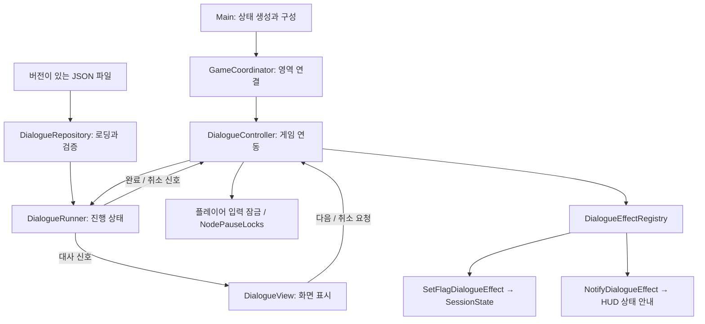

# 대화 시스템 구조와 확장 규칙

## 목적과 현재 범위

대화 콘텐츠가 늘어나도 맵, 플레이어, HUD를 함께 수정하지 않도록 데이터 검증, 진행 상태, 표현, 게임 효과를 분리했습니다. 현재 지원하는 플레이 동작은 **순서대로 진행하는 대화와 완료 효과**입니다.

선택지·조건 분기, 대화 도중 저장, 현지화, 음성·초상화는 아직 구현하지 않았습니다. 이번 변경은 해당 기능을 붙일 책임 경계와 회귀 검사를 마련하는 작업입니다. 상용 출시 전체 요건이 완료되었다는 의미는 아닙니다.

## 의존성 구조



`DialogueRepository`, `DialogueRunner`, 데이터 객체와 효과 처리기는 `RefCounted`입니다. 이들은 `Main`, 플레이어 노드, HUD, `SceneTree`를 참조하지 않습니다. `DialogueController`가 대화 진행을 실제 게임 노드와 연결하며, `GameCoordinator`가 서비스 생성과 인게임·UI 간 연결을 담당합니다. 전체 씬 구조는 [게임 구조 가이드](game-architecture.md)를 참고하세요.

| 클래스 | 담당 책임 | 담당하지 않는 일 |
|---|---|---|
| `DialogueLine`, `DialogueEffect`, `DialogueDefinition` | 검증 후 사용할 타입이 있는 데이터, 깊은 복사 | 파일 읽기, 게임 상태 수정 |
| `DialogueRepository` | 여러 파일 로딩, 스키마 검증, ID 조회, 일괄 교체 | 대화 진행, 이동 잠금 |
| `DialogueRunner` | 시작·다음·완료·취소, 신호 순서, 중복 호출 방지 | 입력 장치, 화면, 권한 지급 |
| `DialogueView` | 독립 씬에서 대사 표시, 스크롤, 다음·취소 입력 신호 | 보상 결정, 데이터 로딩 |
| `DialogueController` | 진행 객체·UI 연결, 잠금 획득·해제, 완료 효과 실행 | 대사 인덱스 관리, JSON 해석 |
| `DialogueEffectRegistry` | 효과 타입 등록·검증·순서대로 실행 | 특정 퀘스트의 조건 |
| `DialogueEffectHandler` 파생 클래스 | 효과별 파라미터 검증과 실행 | 대화 화면과 이동 제어 |
| `SessionState` | 플래그 조회·변경과 변경 신호 | 디스크 저장 |
| `NodePauseLocks` | 토큰별 정지 소유권, 마지막 해제 시 이전 처리 모드 복원 | 대화 규칙 |

## 데이터 형식: schema_version 1

기존 `grant_flag`는 `on_complete`의 효과 목록으로 이전했습니다. 구형 필드가 남아 있으면 조용히 무시하지 않고 로딩을 거부합니다.

```json
{
  "schema_version": 1,
  "dialogues": {
    "library_welcome": {
      "lines": [
        {"speaker": "도서부원", "text": "도서관에 온 걸 환영해."},
        {"speaker": "도서부원", "text": "출입 등록을 완료했어."}
      ],
      "on_complete": [
        {"type": "set_flag", "parameters": {"key": "library_access", "value": true}},
        {"type": "notify", "parameters": {"text": "도서관 출입 등록 완료"}}
      ]
    }
  }
}
```

- `dialogues`는 비어 있지 않은 객체이며 키는 대화 ID입니다.
- `lines`는 하나 이상의 대사가 있는 배열입니다. `speaker`, `text`는 공백뿐이지 않은 문자열이어야 합니다.
- `on_complete`는 선택 항목이며 생략하면 효과가 없습니다.
- `set_flag`는 `key: String`, `value: bool`을 받습니다. 같은 값을 다시 설정해도 변경 신호를 중복 발생시키지 않습니다.
- `notify`는 `text: String`을 받아 HUD에 표시합니다. 본관, 도서관 등 구체적인 안내는 데이터에 둡니다.
- 알 수 없는 필드, 효과 타입, 잘못된 파라미터는 거부합니다. 파일 경로, 대화 ID, 대사/효과 인덱스를 오류에 포함합니다. JSON 구문 오류에는 줄 번호도 포함합니다.

캐릭터와 사물의 `Interaction` 컴포넌트에 연결한 `DialogueInteraction` Resource의 `dialogue_id`로 대화를 참조합니다. 잠긴 문 안내는 `DoorInteraction` Resource의 `locked_dialogue_id`를 사용합니다. 행동 설정과 NPC 추가 방법은 [캐릭터 시스템 가이드](character-system.md)를 참고하세요.

### 콘텐츠 파일 분리

`Main`의 `dialogue_sources`에 챕터나 지역별 JSON 경로를 추가할 수 있습니다. 파일마다 위 형식을 사용합니다.

모든 파일을 임시 목록에 읽고 검증한 후에만 저장된 목록을 교체합니다. 한 파일이라도 실패하거나 파일 간 대화 ID가 중복되면 전체 교체를 거부하며 기존 목록을 유지합니다. 최초 로딩 실패 시에는 대화를 시작할 수 없고, 월드 초기화는 계속되어 이동이 잠기지 않습니다. 오류는 로그와 HUD에 표시합니다.

진행 중인 대화는 시작 시의 복사본을 소유하므로 이후 목록을 다시 불러와도 중간 대사가 바뀌지 않습니다. 조회한 데이터나 신호로 받은 대사를 수정해도 원본 목록과 실행 중인 대화에는 영향을 주지 않습니다.

## 진행 상태 계약

`DialogueRunner`의 상태는 `IDLE → ACTIVE → FINISHING → IDLE`입니다.

- `start(id)`는 성공 시 `OK`, 진행 중이면 `ERR_BUSY`, 없는 ID는 `ERR_DOES_NOT_EXIST`, 목록이 준비되지 않았으면 `ERR_UNCONFIGURED`를 반환합니다.
- 성공한 시작은 `started` 신호 다음에 첫 `line_changed` 신호를 보냅니다.
- `advance()`가 마지막 대사를 넘겼을 때만 완료됩니다. 외부에서 임의로 `finish(true)`를 호출하는 API는 없습니다.
- `cancel()`은 완료 효과가 없는 취소로 종료합니다.
- 완료·취소 이후의 `advance()`와 `cancel()`은 `false`를 반환하며 아무 효과도 내지 않습니다.
- 신호를 처리하는 도중 시작·진행·취소를 재호출하면 거부합니다. 다른 대화를 연결하려면 현재 신호 처리가 끝난 다음 `call_deferred` 등으로 새 요청을 보냅니다.
- 완료 효과는 **한 실행 세션에서 한 번만** 전달합니다. 같은 대화를 다시 시작해 끝내면 새 세션이므로 효과가 다시 실행됩니다. 일회성 아이템 보상은 향후 퀘스트/보상 서비스에서 수령 기록으로 제한해야 합니다.

## UI와 입력

`scenes/ui/dialogue_view.tscn`은 HUD와 독립적인 씬입니다. 위치, 색상, 글자 크기와 배치는 에디터에서 변경할 수 있습니다.

`present(line, index, total)`과 `close()`로 표시를 제어합니다. 내부 라벨이나 패널을 외부에서 직접 조작하지 않습니다. 긴 대사는 본문 영역에서 스크롤할 수 있고 화자·조작 안내는 고정됩니다.

대화창은 다음·닫기 입력을 먼저 소비한 뒤 신호를 보냅니다. 대화를 닫은 E가 같은 프레임에 NPC 상호작용으로 전달되어 다시 열리거나, Esc가 게임 일시정지까지 실행되지 않습니다. 대화를 여는 E도 첫 대사를 건너뛰지 않습니다.

## 이동과 구역 정지의 소유권

잠금을 단일 `bool`로 공유하면 대화가 끝날 때 컷신의 잠금까지 풀 수 있습니다. 현재는 각 요청이 별도의 토큰을 받습니다.

```gdscript
var input_token := player.acquire_control_lock()
var zone_token := pause_locks.acquire(current_zone)
# 컷신이나 연출 수행
player.release_control_lock(input_token)
pause_locks.release(zone_token)
```

- 모든 입력 잠금이 해제되어야 캐릭터가 다시 움직입니다.
- 같은 구역의 정지는 공용 `NodePauseLocks` 인스턴스를 사용합니다. 마지막 토큰 해제 시 최초의 `process_mode`를 그대로 복원합니다.
- `DialogueController`는 자신이 획득한 토큰만 해제합니다. 대화 전후에 다른 시스템이 획득한 잠금도 보존합니다.
- 구역 전환은 InGame이 연결부의 사전 콜백을 호출하여 진행 중인 대화를 취소하고 이전 구역의 잠금을 해제한 뒤 씬을 교체합니다.
- 컨트롤러 제거 시에도 취소와 해제를 수행합니다. 중복 해제와 이미 삭제된 구역의 해제는 안전하게 처리합니다.
- 잠금 관리자를 사용하는 동안 다른 코드에서 같은 노드의 `process_mode`를 직접 덮어쓰지 않습니다. 정지가 필요한 새 시스템도 같은 관리자에서 토큰을 획득합니다.

## 새 완료 효과 추가

퀘스트 시작, 아이템 지급 등은 `DialogueEffectHandler`를 상속한 처리기로 추가합니다.

1. `validate(parameters)`에서 필요한 필드와 타입을 검사하고 오류 문자열 또는 빈 문자열을 반환합니다. 검증은 게임 상태를 바꾸지 않습니다.
2. `apply(parameters)`에서 해당 서비스의 공개 API를 호출합니다. 플레이어나 HUD 전체를 참조하지 말고 필요한 서비스만 생성자로 전달합니다.
3. `GameCoordinator.configure()`의 객체 연결 부분에서 `register_handler()`로 타입 이름과 객체를 등록합니다.
4. 레지스트리를 `seal()`한 후 콘텐츠를 읽습니다. 같은 타입의 중복 등록과 실행 중 타입 교체는 거부합니다.
5. JSON의 `on_complete`에 타입과 파라미터를 작성합니다.
6. 잘못된 파라미터 거부, 취소 시 미실행, 완료 시 1회 실행을 테스트합니다.

새 효과를 추가해도 Repository, Runner, View의 코드는 바꿀 필요가 없습니다. 테스트의 `CountingEffect`가 이 확장 방법을 실제로 검증합니다.

현재 실행기는 효과 목록 전체를 재검증한 다음 **동기적으로 순서대로** 적용합니다. 임의 처리기의 실행 실패를 되돌리는 트랜잭션, 네트워크 요청, 디스크 저장의 원자성은 제공하지 않습니다. 인벤토리·결제·영구 보상을 추가할 때는 해당 서비스가 트랜잭션과 중복 지급 방지를 책임지도록 구현해야 합니다.

## 앞으로 기능별 수정할 위치

| 기능 | 주로 확장할 위치 |
|---|---|
| 새 NPC 대화, 안내 문구 | JSON과 맵의 대화 ID |
| 초상화·타자 효과·음성 표시 | 대사 모델·검증 규칙·View |
| 조건·선택지·분기 | 새 스키마 버전, 데이터 모델, Runner 전이, View 선택 입력 |
| 퀘스트·아이템 효과 | 효과 처리기와 해당 게임 서비스 |
| 현지화 | 화자/대사 키와 별도 텍스트 조회 경계 |
| 저장·복원 | SessionState 저장 서비스, 대화 ID·진행 위치 스냅샷과 버전 마이그레이션 |

스키마를 바꿀 때는 버전을 명시하고 기존 콘텐츠를 변환하는 절차와 테스트를 함께 추가합니다. 지원하지 않는 새 필드를 조용히 무시하는 방식으로 확장하지 않습니다.

## 검증 명령

```sh
godot --headless --path gd-game-02 --editor --import --quit
godot --headless --path gd-game-02 --script res://tests/dialogue_test.gd
godot --headless --path gd-game-02 --script res://tests/systems_test.gd
```

대화 전용 검사는 데이터 오류, 최초 로딩 실패, 실패한 재로딩, 복사본 격리, 세션 재진입, 효과 검증·완료·취소, 잠금 중첩, 구역 전환, 컨트롤러 제거와 실제 키 입력을 확인합니다. 기존 게임 검사는 이동·상호작용·문 출입 등 정상 플레이 회귀를 확인합니다. 화면에서는 일반 대사, 긴 본문 스크롤과 닫기 상태를 검증합니다.

## 관계 연동

완료 효과 `add_affinity`와 `RelationshipDialogueInteraction`의 조건별 대사를 추가했습니다. 방향별 ID, 일회성 보상 키, 재방문 대화 설정은 [관계·생활 시스템 가이드](relationship-life-system.md)를 참고하세요. 대화 컨트롤러는 게임 시계의 잠금도 소유하여 완료·취소·제거 시 해제합니다.

대화 중 전투를 방지하기 위해 전체 행동 잠금에 공격·복귀를 포함합니다. HealthComponent가 있는 플레이어에는 대화 소유의 피격 보호 토큰도 적용하고, 대화 종료 시 해당 토큰만 해제합니다.
