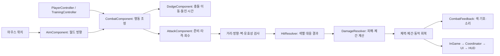

# 마우스 조준과 색별 대응 전투

기본 공격·가드·회피·보라색 공격에 **스태미나를 사용하지 않는 전투 프로토타입**입니다. 운동장 오른쪽 훈련 로봇을 통해 1대1 공방을 연습할 수 있습니다. 수치는 플레이 테스트를 위한 시작값입니다.

## 실행과 조작

Godot에서 `gd-game-02/project.godot`을 열고 F5로 실행합니다. 운동장 오른쪽 로봇 가까이에서 커서를 로봇에 두고 좌클릭하면 훈련을 시작합니다.

| 입력 | 행동 |
|---|---|
| WASD / 방향키 | 8방향 이동 |
| 마우스 커서 | 공격·가드·돌진 방향. 발밑 흰 화살표가 현재 조준 방향 |
| 좌클릭 | 기본 공격. 가까운 적의 체간이 무너졌으면 제압 |
| 우클릭 유지 | 커서 방향으로 가드 |
| 타격 직전 우클릭을 새로 누르기 | 일반·푸른 공격 튕겨내기 |
| Shift | 커서 방향 짧은 회피 돌진. 붉은 공격에 맞춰 적 쪽으로 돌진하면 패링 |
| Q | 보라색 공격. 적의 보라색 공격과 타격 구간이 겹치면 상쇄 |
| E | 훈련 로봇 체력 회복과 양쪽 체간·공격·회피 초기화 |
| R | 훈련 종료 후 체크포인트 복귀. 전투 불능이면 플레이어 체력도 회복 |
| Esc | 일시정지 |

기존 J/K와 패드 B/LB 공격·가드도 유지합니다. 패드는 A 회피, RB 보라색 공격입니다. 패드 입력을 사용하면 캐릭터가 바라보는 방향으로 조준하며, 마우스를 움직이면 커서 조준으로 돌아옵니다. 대화 중 A는 기존처럼 대사를 진행합니다.

E는 가드를 놓고 동작을 마친 뒤 사용합니다. 공격·회피·붕괴 중에는 R 복귀를 할 수 없지만 체력 0에서는 복귀할 수 있습니다. 살아 있는 플레이어의 체력은 E/R로 회복하지 않습니다.

## 공격별 대응

| 적 공격 | 일반 가드 | 정확한 대응 | 성공 보상 |
|---|---|---|---|
| 일반 / 노랑 | 가능 | 타격 직전 우클릭 또는 회피 | 튕김 시 상대 체간 +12 |
| 푸름 / `□ 가드 ×3 · 튕김` | 가능, 내 체간 +54 | 타격 직전 우클릭 | 내 체간 증가 없이 상대 체간 +12 |
| 붉음 / `↑ Shift 돌진` | 불가, 우클릭 튕김도 불가 | 적을 향한 돌진 중 적 타격에 접촉 | 상대 체간 +24, 플레이어 즉시 후속 공격 가능 |
| 보라 / `◇ Q 상쇄` | 불가, 우클릭 튕김도 불가 | 서로를 향한 보라색 공격의 타격 구간을 겹치기 | 양쪽 피해 제거, 플레이어가 먼저 회복 |

붉은 공격은 돌진 시작 후 **0초 초과~0.12초 이내**, 실제 이동 1px 이상, 적 방향과 돌진 방향 사이 각도 40도 이내여야 패링합니다. Shift를 누르기만 하거나 반대 방향으로 돌진하면 실패합니다. 벽에 막힌 정지 돌진도 성공하지 않습니다.

보라색 상쇄는 단순히 Q를 누른 상태로 성립하지 않습니다. 양쪽이 같은 프레임에 타격 구간에 있고 서로의 Hurtbox에 닿으며, 벽 검사를 통과해야 합니다. 준비 동작이나 일반 공격으로는 상쇄할 수 없습니다. 상쇄 후 플레이어 회수는 0.08초, 로봇은 0.32초여서 근접 공격을 이어갈 수 있습니다.

회피의 일반·푸른 공격 무적 구간은 돌진 시작 후 0.03~0.13초입니다. 붉은·보라색 공격은 이 무적을 무시합니다. 모든 공격은 실제 타격 범위 밖으로 이동해 피할 수도 있습니다.

## 훈련 흐름과 리듬

1. 로봇은 가드하며 기다립니다. 첫 공격을 받으면 훈련을 시작합니다.
2. **일반 → 푸름 → 붉음 → 보라** 순서로 공격합니다. 공격 사이 대기는 0.12초, 한 순환 뒤 가드 구간은 0.7초입니다.
3. 정확한 방어로 적 체간을 쌓고, 상쇄·돌진 패링 뒤의 유리한 회복 시간을 이용해 공격합니다.
4. 로봇 체간이 100이면 0.8초 동안 붕괴합니다. 가까이서 조준하고 좌클릭하면 제압합니다. 체력을 0으로 만들어도 승리합니다.
5. 제압 기회를 놓치면 로봇은 체간 35로 회복합니다. 플레이어 붕괴는 0.65초이며 전투 불능과 별개입니다.

로봇은 추격하지 않습니다. 240px보다 멀어지거나 R로 복귀하면 훈련과 체간을 초기화합니다. 전투 중 맵 전환을 막으며, 체력 피해와 전투 불능은 캐릭터 ID에 유지합니다.

스태미나 대기 대신 **공격 준비·회수와 회피 회수**가 행동 반복을 제한합니다. Q는 일반 공격보다 느리므로 모든 상황에서 Q만 반복하는 것이 최선이 되지 않도록 시작 수치를 잡았습니다. 실제 우열과 난이도는 플레이 테스트로 조정해야 합니다.

## 현재 수치

| 공격 | 피해 | 준비 / 타격 / 회수 | 사거리 / 각도 |
|---|---:|---|---|
| 플레이어 기본 | 12 | 0.12 / 0.06 / 0.22초 | 85px / 100도 |
| 플레이어 보라 | 18 | 0.22 / 0.14 / 0.38초 | 85px / 100도 |
| 로봇 일반 | 10 | 0.38 / 0.06 / 0.24초 | 85px / 100도 |
| 로봇 푸름 | 14 | 0.55 / 0.06 / 0.28초 | 85px / 100도 |
| 로봇 붉음 | 18 | 0.75 / 0.06 / 0.42초 | 100px / 70도 |
| 로봇 보라 | 22 | 0.85 / 0.16 / 0.40초 | 100px / 100도 |

- 플레이어 체력 100, 로봇 체력 160. 체간 최대 100.
- 돌진 속도 620px/초, 이동 0.18초, 회수 0.2초. 실제 이동은 충돌에 막힙니다.
- 가드는 전방 140도. 튕김 시간 0.12초, 새 튕김 입력 최소 간격 0.18초.
- 플레이어 일반 공격의 가드 부담 8, 로봇 일반 공격은 18. 푸름은 해당 공격의 가드 부담 ×3.
- 체간은 부담이 없는 상태로 1초가 지나면 초당 `4 + 12 × 현재 체력 비율`만큼 회복합니다.
- 기존 스태미나 컴포넌트·저장 버전 3은 호환을 위해 유지합니다. HUD는 체력과 체간을 표시합니다. 생활 피로는 전투 속도나 판정 시간을 바꾸지 않습니다.

## 구현 구조



| 클래스 | 책임 |
|---|---|
| `AimComponent` | 카메라 변환을 반영한 커서 조준. 4방향 캐릭터 시선과 연속적인 전투 방향 분리 |
| `DodgeComponent` | 충돌을 지키는 돌진, 이동·회수 시간, 방향·타이밍 조건 |
| `CombatComponent` | 행동 조정, 입력 예약, 피격 요청 검증·결과 적용 |
| `AttackComponent` | 공격 단계·대상 유지·범위 검사·요청 생성·중복 접촉 방지 |
| `SkillComponent` | 스킬 보유·슬롯·재사용 대기시간. Q는 슬롯 0 사용 |
| `DamageResolver` | 피해 타입별 저항과 체간 부담 계산 |
| `AttackDefinition` | 공격 종류·피해·동작 시간·범위·상쇄 후 회수 설정 |
| `HitResolver` | 장면이나 수치를 변경하지 않는 순수 대응 판정 |
| `GuardComponent` / `PostureComponent` | 가드 타이밍·방향 / 체간 누적·회복·붕괴 |
| `HealthComponent` | 기존 피해·회복·전투 불능·명시적 부활 계약 |
| `TrainingController` | 동일한 전투 API를 사용하는 4종 공격 순환 |
| `CombatFeedback` | 색·문자 기호·범위·효과음. UI가 판정을 결정하지 않음 |

공격 설정은 `.tres` 리소스에서 조정합니다. 스킬·피해 타입·컴포넌트 확장 방법은 [공격·스킬·피해 가이드](attack-skill-damage.md)에 정리했습니다. 조준과 회피는 플레이어 씬의 선택적 자식 컴포넌트입니다. 일반 학생에게 전투 기능을 강제하지 않습니다.

### 입력·수명 계약

- 마우스 조준은 적에게 자동으로 방향을 맞추지 않습니다. 공격 방향은 시작 순간 고정하고, 가드 방향은 커서를 따라 갱신합니다.
- 일반 공격은 타격 시점의 Hitbox에 겹치는 적들을 수집합니다. 타격 구간에 새로 들어온 적도 맞으며, 적마다 한 번만 판정합니다.
- 공격 설정을 시작 시 복사하며 한 공격은 대상별로 한 번만 접촉 판정을 소비합니다.
- 준비 동작 첫 0.06초에는 가드·회피 취소가 가능합니다. 이후는 동작 완료까지 유지합니다.
- 공격 회수 마지막 0.1초에는 기본 공격·가드·Q·Shift 중 최신 입력 하나를 예약합니다. 가드 해제는 가드 예약을 취소합니다.
- 우클릭을 누른 채 공격하면 완료 뒤 일반 가드로 복귀합니다. 자동으로 튕김을 반복하지 않습니다.
- 모든 공격은 같은 물리 프레임의 동작 갱신 이후 CombatResolver에서 처리합니다. 보라색 상쇄는 관련 공격들을 먼저 취소한 뒤 결과를 알립니다.
- 동작 번호로 지연 판정을 식별합니다. 초기화·대화 잠금·새 동작 후 이전 판정이 실행되지 않습니다. 대화 잠금은 공격과 회피를 취소하고, 일시정지는 시간을 정지합니다.
- 동시 치명타·다중 상쇄·돌진 패링 규칙과 3명 훈련 실행법은 [다수전 가이드](multi-combat-hitboxes.md)를 참고하세요.

## 검증과 다음 단계

`colored_combat_test.gd`에서 색별 피해·체간, 올바른/잘못된/늦은 돌진, 상쇄의 양쪽 처리 순서, 상쇄 후 잔여 피해 방지, 실제 마우스·Q·Shift 입력, 카메라 좌표 변환, 벽 충돌, 대화 잠금·일시정지·입력 예약을 검사합니다. `duel_test.gd`는 실제 훈련 AI의 4종 순환을 포함합니다.

```sh
godot --headless --path gd-game-02 --editor --import --quit
godot --headless --path gd-game-02 --script res://tests/colored_combat_test.gd
godot --headless --path gd-game-02 --script res://tests/duel_test.gd
```

기존 combat, character, life, relationship, systems, dialogue, ui_world 검사도 유지합니다. 색별 전투 도입 당시 자동 검사 **9개 모음, 493개 통과**. 이후 컴포넌트 확장 검사는 [확장 가이드](attack-skill-damage.md)를 참고하세요. 실제 렌더링 화면에서 HUD·색별 예고·돌진 패링·상쇄 표시도 확인했습니다.

현재 그래픽과 효과음은 임시 표현입니다. 실제 패드 기기, 사람의 반응 속도를 기준으로 한 판정 시간·난이도, 무기 애니메이션·콤보·다수전 난이도·히트스톱은 후속 검증 범위입니다.
