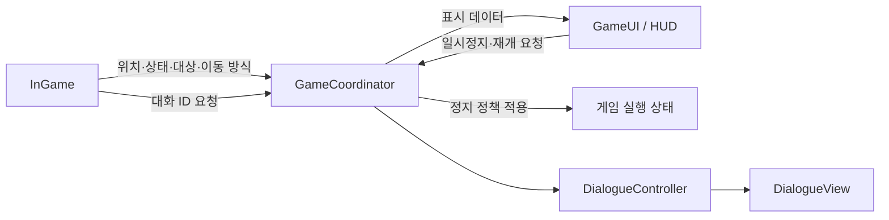

# 인게임과 UI 분리 구조

## 실행 씬

```text
Main (Node)
├── InGame (독립 씬, Node2D)
│   ├── CurrentZone (실행 중 교체)
│   │   ├── 배경·충돌·가구
│   │   └── NPC·문·게시판·체크포인트
│   └── Player
│       ├── CollisionShape2D
│       ├── Movement / Controller / Visual / Needs / Health / Stamina
│       ├── InteractionDetector
│       └── Camera2D
├── UI (독립 씬, Node)
│   ├── HUD (독립 씬, CanvasLayer 10)
│   ├── DialogueView (독립 씬, CanvasLayer 20)
│   └── PauseMenu (독립 씬, CanvasLayer 30)
├── DialogueController
└── GameCoordinator
```

`SessionState`와 `NodePauseLocks`는 Main이 소유하는 일반 객체이며 씬 노드는 아닙니다. 메인 씬은 이 객체들과 하위 씬을 연결부에 전달합니다. `Main`에는 입력, 구역 전환, HUD 위젯 수정 로직이 없습니다.

## 책임 경계

| 구성 요소 | 책임 |
|---|---|
| `InGame` | 플레이어·맵·카메라 소유, 캐릭터·상호작용 요청 연결, 구역 교체, 체크포인트 |
| `GameUI` | HUD·대화창·일시정지 화면의 묶음, 화면 표시 API, 일시정지·재개 요청 |
| `SchoolHUD` | 위치·상태·상호작용·이동 방식 표시 |
| `PauseMenu` | 일시정지 화면 표시, 키보드·패드·마우스의 재개 요청 |
| `GameCoordinator` | 인게임과 UI의 신호 연결, 대화 서비스 초기화, 전환 전 대화 취소, 전체 일시정지 조율 |
| `DialogueController` | 대화 진행 객체와 대화창 연결, 대화 소유의 이동·구역 잠금 |
| `SessionState` | 구역이 바뀌어도 유지할 진행 플래그, 캐릭터 상태, 관계 서비스, 게임 시간과 신체 상태 서비스 |

캐릭터 내부의 입력·AI·이동·표현과 상호작용 행동은 [캐릭터 시스템 가이드](character-system.md)를 참고하세요. 사용자 입력은 `PlayerController`, 대상 감지는 `InteractionDetector`, 개별 행동은 `InteractionAction` 하위 클래스에서 담당합니다.

### 참조 규칙

- **InGame은 UI 클래스를 참조하지 않습니다.** HUD, 버튼, 라벨, 대화창을 찾거나 생성하지 않습니다.
- **HUD는 게임 노드를 참조하지 않습니다.** NPC 객체 대신 이름·행동 문자열을, 플레이어 enum 대신 방향 개수를 받습니다.
- **UI는 게임 실행 상태를 직접 변경하지 않습니다.** 메뉴를 보여 주는 것과 실제 게임을 정지하는 것은 별개입니다.
- **연결부만 양쪽을 압니다.** 기존 대화 서비스도 연결부에서 필요한 인게임 객체와 대화창을 주입받습니다.
- 구역 노드의 실제 참조인 `zone_changed`는 게임 연동용 신호입니다. UI에는 별도의 `location_changed(String)` 값만 전달합니다.

## 신호 흐름



| InGame 출력 | UI 표시 API |
|---|---|
| `location_changed(title)` | `show_location(title)` |
| `status_changed(message)` | `show_status(message)` |
| `interaction_prompt_changed(display_name, action)` | `show_interaction(display_name, action)` |
| `movement_mode_changed(direction_count)` | `show_movement_mode(direction_count)` |

연결은 `GameCoordinator.configure()`에 모여 있습니다. UI가 다른 표시 방식으로 바뀌어도 인게임 코드는 수정할 필요가 없습니다. 연결부가 제거되면 등록한 신호 구독도 해제합니다.

## 구역 전환과 대화

`InGame.load_zone()`은 도착 구역과 스폰 지점을 먼저 검증합니다. 이후 주입된 전환 전 콜백을 호출합니다.

전체 게임에서는 `GameCoordinator`가 이 콜백을 제공하여 진행 중인 대화를 취소하고 이전 구역의 대화 잠금을 해제합니다. 완료 효과를 처리하는 도중처럼 재진입을 허용할 수 없는 상황이면 전환을 거부합니다. 거부 시 기존 구역은 유지됩니다.

인게임 단독 실행에서는 콜백 없이 맵을 전환할 수 있습니다. 대화 ID를 요청하는 신호는 발생하지만 대화창·완료 보상은 연결되지 않습니다.

## 일시정지와 수명 관리

- InGame은 `PAUSABLE`, UI와 연결부는 `ALWAYS` 처리 모드를 사용합니다. 게임을 정지해도 메뉴 입력은 동작합니다.
- 게임 중 Esc/패드 Start는 UI의 일시정지 요청을 만듭니다. 연결부는 대화·구역 전환·입력 잠금 여부를 확인하고 승인한 경우에만 게임을 정지합니다.
- 메뉴의 계속하기 버튼은 마우스, Enter/Space/패드 확인 버튼으로 누를 수 있습니다. Esc/패드 Start로도 재개합니다.
- 메뉴를 열면 계속하기 버튼에 포커스를 주고, 닫으면 포커스를 해제합니다.
- Esc를 소비한 뒤 재개 요청을 보내므로 닫는 키가 다시 일시정지를 켜지 않습니다.
- 대화창의 Esc는 대화 취소로 소비되어 일시정지 메뉴까지 열지 않습니다.
- 연결부는 자신이 건 전역 일시정지만 해제합니다. 게임 씬을 제거할 때도 이를 복원하므로 다음 씬이 멈춘 채 남지 않습니다.
- 다른 시스템이 먼저 게임을 정지했다면 현재 메뉴의 재개 요청이나 게임 제거로 그 정지를 해제하지 않습니다.

새 모달 UI에서 게임 전체를 멈추려면 연결부의 정책을 확장하세요. UI 스크립트에서 `SceneTree.paused`를 직접 변경하거나 여러 메뉴가 별도로 일시정지 상태를 소유하지 않도록 합니다.

## 편집할 파일과 단독 실행

| 작업 | 파일 |
|---|---|
| 전체 게임 실행 | `gd-game-02/scenes/main.tscn` — F5 |
| HUD 없는 이동·맵 확인 | `gd-game-02/scenes/game/ingame.tscn` — F6 |
| UI 전체 구성 확인 | `gd-game-02/scenes/ui/game_ui.tscn` — F6 |
| HUD 위치·폰트·간격 편집 | `gd-game-02/scenes/ui/hud.tscn` |
| 일시정지 메뉴 배치·버튼 편집 | `gd-game-02/scenes/ui/pause_menu.tscn` |
| 대화창 배치 편집 | `gd-game-02/scenes/ui/dialogue_view.tscn` |
| 인게임 동작 | `gd-game-02/scripts/game/ingame.gd` |
| 영역 간 연결·일시정지 정책·효과 등록 | `gd-game-02/scripts/game/game_coordinator.gd` |
| UI 표시 메서드 | `gd-game-02/scripts/ui/` |

인게임 씬의 `auto_start` 기본값은 켜져 있어 단독 실행 시 운동장이 생성됩니다. Main 안의 인스턴스는 이를 끄고, 연결부가 신호와 상태를 연결한 후 시작합니다.

UI 단독 실행은 기본 안내를 표시합니다. 게임 없이 메뉴의 요청 신호를 보내도 실제 일시정지는 발생하지 않습니다. 대화창과 일시정지 창은 기본적으로 닫혀 있으며 각각 `present()`와 `open()`으로 표시합니다.

HUD 위젯은 코드에서 생성하지 않고 씬에 선언되어 있어 에디터에서 배치를 확인할 수 있습니다. 다른 코드에서 내부 라벨을 수정하지 말고 공개된 표시 메서드를 사용합니다.

## 검증

```sh
godot --headless --path gd-game-02 --editor --import --quit
godot --headless --path gd-game-02 --script res://tests/character_test.gd
godot --headless --path gd-game-02 --script res://tests/ui_world_test.gd
godot --headless --path gd-game-02 --script res://tests/dialogue_test.gd
godot --headless --path gd-game-02 --script res://tests/systems_test.gd
```

분리 구조 검사는 UI·인게임 단독 실행, 값 기반 HUD 표시, 신호 연결, 전환 거부, 메뉴 포커스, 실제 키·포인터 입력, 게임 제거 시 일시정지 복원과 연결부 제거 시 구독 해제를 확인합니다. 기존 대화·게임 검사는 정상 플레이 회귀를 확인합니다.

헤드리스 창의 실제 픽셀 크기와 UI 뷰포트 크기는 다를 수 있으므로 포인터 검사에서는 뷰포트 좌표를 명시해 입력을 전달합니다. [Godot Viewport 입력 문서](https://docs.godotengine.org/en/stable/classes/class_viewport.html#class-viewport-method-push-input)

관계 변화와 시간·신체 상태 흐름은 [관계·생활 시스템 가이드](relationship-life-system.md)를 참고하세요. 게임 시계는 InGame이 구동하고, 대화와 메뉴는 각각 시계 잠금 토큰을 보관합니다.

플레이어와 훈련 로봇에는 선택적 Combat·CombatFeedback을 추가했습니다. 체력·스태미나도 인게임의 값 시그널을 연결부를 거쳐 HUD에 전달합니다. [전투 기반 가이드](combat-system.md)에서 책임과 확장 위치를 확인할 수 있습니다.
