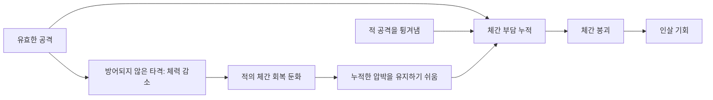
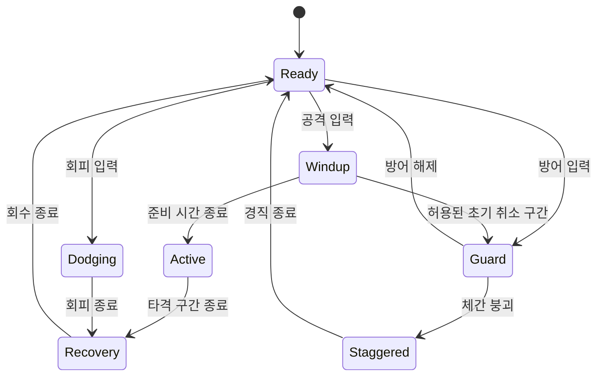
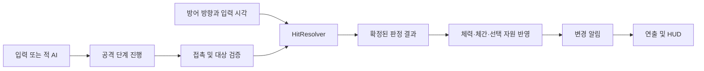

# 세키로 전투 분석과 우리 게임의 스태미나 설계안

> 작성일: 2026-09-17 · 상태: 원안 보존 · 기본 공방 A안 구현 완료
>
> 대상: 《방과 후, 종이 울리면》의 2D 탑다운 전투.
> 목적: 세키로에서 느낀 긴장감·속도감의 원리를 이해하고, 스태미나의 역할을 결정한다.

**구현 후속:** [체간 공방 프로토타입 A안](duel-prototype.md)에 실제 적용 범위·수치·조작과 보류 항목을 기록했습니다. 아래 문서의 현재 코드 비교는 구현 전 기준이며, 제안 전체가 그대로 적용된 것은 아닙니다.

## 1. 먼저 결론

**우선 ‘기본 공격·방어에 스태미나가 없는 전투’를 만들고, 공격과 튕겨내기를 주고받는 재미부터 검증하는 것을 권한다.**

현재 필요한 것은 체간, 방어 판정, 읽을 수 있는 적의 공격, 공격에서 방어로 넘어가는 규칙이다. 스태미나를 제거하는 것만으로 이 경험이 만들어지지는 않는다.

기본 전투가 재미있어진 뒤에도 별도 자원이 필요하면 **강한 기술·긴 이동 같은 추가 선택에만 쓰는 방식**을 비교한다. 자원이 0이어도 기본 공격·가드·튕겨내기·일반 이동은 가능하게 한다.

| 결정할 질문 | 잠정 제안 | 이유 |
|---|---|---|
| 기본 공격에 스태미나를 쓸까? | 비용 0부터 실험 | 가까이서 공격과 방어를 이어가는 흐름을 먼저 확인 |
| 가드·튕겨내기에 비용을 붙일까? | 별도 스태미나 비용 없음 | 방어 위험은 체간과 대응 실패로 표현 |
| 스태미나 자체를 삭제할까? | 비교 실험 뒤 판단 | 기존 구현은 특수 행동 자원으로 재사용 가능 |
| 학교생활의 피로도 없앨까? | 유지 | 하루의 생활과 순간의 전투는 서로 다른 설계 목적 |
| 지금 바로 게임 규칙을 바꿀까? | 이 문서는 설계까지 | 아래 수치·조작·클래스는 후속 프로토타입 제안 |

## 2. 조사 범위와 근거 구분

- **확인 사실**: 프롬소프트웨어 공식 매뉴얼·팁, Activision 설명, 제작자 인터뷰에 근거한다.
- **설계 해석**: 확인한 규칙이 어떤 플레이를 유도하는지 분석한 내용이다. 제작자의 의도와 완전히 같다고 단정하지 않는다.
- **우리 게임 제안**: 아직 구현하지 않은 규칙이다. 수치는 세키로의 추출 데이터가 아닌 실험 시작값이다.
- 세키로의 모든 보스·도구·난이도 예외를 재현하는 문서는 아니다. 일반적인 검술 교전의 구조를 중심으로 다룬다.
- 정확한 튕겨내기 프레임, 연타에 따른 판정 변화, 무적 시간, 체간 회복 계수는 이번 공식 문서 조사로 확정하지 않았다. 검증되지 않은 숫자를 원작 사양으로 사용하지 않는다.

## 3. 세키로의 전투는 무엇을 주고받는가

### 3.1 체력과 체간: 두 개의 진행 축

**확인 사실.** 공격은 적의 체간에 부담을 주며, 막히지 않으면 체력도 깎는다. 적의 체력이 낮을수록 체간 회복이 느려진다. 일반 가드는 튕겨내기보다 자신의 체간 부담이 크다. 체간을 무너뜨리면 제한된 시간 동안 인살 기회가 생기고, 일부 강적은 여러 번의 인살이 필요하다. [프롬소프트웨어 공식 전투 매뉴얼](https://www.fromsoftware.jp/manual/sekiroshadowsdietwice/stadia/mechanics.html)

이 문서에서 **체간 게이지가 증가한다**는 표현은 ‘자세에 부담이 쌓인다’는 뜻이다. 회복은 그 부담이 줄어드는 것이다.



**설계 해석.** 체력은 오래 남는 진척이고, 체간은 지금 이어가는 교전의 진척이다. 체력 공격은 다음 압박을 쉽게 만들고, 체간 압박은 지금의 기회를 마무리로 연결한다. 두 수치의 목적이 다르므로 체간을 단순히 두 번째 체력으로 구현하면 의미가 줄어든다.

### 3.2 공격과 방어가 같은 승리 조건에 기여한다

**확인 사실.** 튕겨내기는 적 체간에 피해를 주고 반격 기회를 만들 수 있다. 다만 연속 공격에는 여러 차례의 튕겨내기가 필요할 수 있다. 튕겨내기 이후 공격으로 이어지는 반격도 지원한다. [Activision 전투 메커니즘](https://support.activision.com/sekiro/articles/sekiro-shadows-die-twice-game-mechanics), [프로듀서의 전투 팁](https://blog.playstation.com/?p=208887)

**설계 해석.** 방어에 성공한 순간에도 승리 조건이 진행된다. 플레이어는 상대의 공격 시간을 견디면서도 ‘내가 계속 싸우고 있다’고 느낄 수 있다. 튕겨내기 한 번을 모든 적 연속기의 강제 종료로 해석해서는 안 된다.

### 3.3 거리를 벌리면 안전과 압박 사이에 선택이 생긴다

**확인 사실.** 공식 팁은 공격과 튕겨내기를 섞어 적에게 체간 회복 시간을 주지 않는 플레이를 설명한다. 제작자 인터뷰 역시 장기간의 치고 빠지기와 가드만 하는 전술의 한계를 짚는다. [프롬소프트웨어 초반 팁](https://www.sekiro.jp/news_detail_190326_01.html), [프로듀서 Robert Conkey 인터뷰](https://news.xbox.com/en-us/2019/03/19/sekiro-shadows-die-twice-interview/amp/)

**설계 해석.** 후퇴를 금지하지 않으면서도 근접 교전에 가치를 준다. 회복하거나 패턴을 재정비할 수 있지만, 그동안 쌓아둔 압박 일부를 잃을 수 있다. 그렇다고 모든 적을 체력 피해 없이 튕겨내기만으로 잡아야 한다는 뜻은 아니다.

### 3.4 기본 행동의 자유와 특수 수단의 제한

**확인 사실.** 공식 소개는 스태미나 제한 없는 기동을 강조한다. 한편 일부 유파 기술은 카타시로(Spirit Emblems)를 소비한다. 기본 교전의 자유와 특수 수단의 사용 제한이 함께 존재한다. [PlayStation 공식 소개](https://blog.playstation.com/2019/03/22/sekiro-shadows-die-twice-tips-for-dark-souls-bloodborne-veterans/), [Activision 전투 메커니즘](https://support.activision.com/sekiro/articles/sekiro-shadows-die-twice-game-mechanics)

**설계 해석.** 일반적인 행동용 스태미나가 없어도 선택과 제약은 남는다. 거리, 공격 동작의 빈틈, 방어 판단, 특수 도구 사용 여부가 제약을 담당할 수 있다. 카타시로를 초당 회복하는 스태미나와 동일한 자원으로 취급하면 안 된다.

### 3.5 위험 공격은 대응 방법까지 판단하게 한다

**확인 사실.** 위험 공격에는 일반 가드로 막을 수 없는 공격이 포함된다. 예를 들어 적귀의 잡기는 가드·튕겨내기로 막지 못하고 회피하거나 거리를 확보해야 한다. 찌르기에는 간파(Mikiri Counter)라는 별도 대응이 있다. [Activision 게임플레이 소개](https://blog.activision.com/sekiro/2019-03/Sekiro-Shadows-Die-Twice-Gameplay-Overview-Trailer-is-Here), [프롬소프트웨어 초반 팁](https://www.sekiro.jp/news_detail_190326_01.html), [Activision 간파 설명](https://blog.activision.com/fr/sekiro/2019-03/Sekiro-Shadows-Die-Twice-Strategies-Surviving-Your-First-Few-Hours-as-the-One-Armed-Wolf)

**설계 해석.** ‘언제 누르는가’와 ‘어떤 대응을 고르는가’가 함께 중요해진다. 경고 하나에 항상 같은 버튼이 정답이면 읽기의 깊이가 줄어든다. 반대로 종류를 알아볼 수 없는 작은 모션만으로 정답을 요구하면 불합리하게 느껴질 수 있다.

원작의 하단 공격·점프 대응 등 입체적인 행동을 현재 탑다운 게임에 그대로 옮기지는 않는다. 우리 게임에서 읽을 수 있는 공격 분류를 먼저 정한다.

### 3.6 교전 바깥의 선택도 전투를 바꾼다

**확인 사실.** 의수 도구는 적의 방어나 약점에 대응하는 수단이고, 잠입은 교전 시작 조건을 바꿀 수 있다. 회생은 제약이 있는 전투 재기 수단이다. [Activision 게임플레이 소개](https://blog.activision.com/sekiro/2019-03/Sekiro-Shadows-Die-Twice-Gameplay-Overview-Trailer-is-Here), [프롬소프트웨어 공식 매뉴얼](https://www.fromsoftware.jp/manual/sekiroshadowsdietwice/stadia/mechanics.html)

**적용 해석.** 우리 게임에서는 친구에게 정보를 듣거나 훈련으로 패턴을 배우는 식으로 생활과 전투를 연결할 수 있다. 첫 실험에는 잠입·회생·다수의 무기까지 한꺼번에 넣지 않는다. 현재의 R 체크포인트 부활은 개발용 회복 동작이며, 세키로의 전투 중 회생과는 다르다.

## 4. 속도감의 핵심: 다음 판단으로 이어지는 시간

아래는 위 규칙에서 도출한 **설계 해석**이다.

| 속도감을 만드는 요소 | 플레이어가 느끼는 것 | 우리 게임에 필요한 장치 |
|---|---|---|
| 방어 성공도 적을 압박 | 적이 공격할 때도 교전에 참여 | 튕겨내기 → 적 체간 변화 |
| 공격·방어 전환이 읽힘 | 계속 공격할지 멈출지 판단 | 준비 동작, 충돌 결과, 반격 신호 |
| 일관된 성공·실패 피드백 | 왜 맞았는지 다음에 고칠 수 있음 | 피격·가드·튕겨내기의 다른 소리와 형태 |
| 추격해 압박을 유지할 수 있음 | 조금 벌어진 거리를 빠르게 좁힘 | 짧은 이동 보정, 이해 가능한 적 이동 |
| 붕괴 뒤 짧은 마무리 기회 | 누적한 대응에 분명한 보상 | 붕괴 상태와 마무리 행동 |
| 자원 대기보다 상황 판단이 중심 | 게이지 대신 상대를 관찰 | 기본 교전 행동을 자원 부족으로 차단하지 않기 |

**속도감은 무조건 빠른 공격 속도와 같지 않다.** 예고 없는 0.1초 타격보다, 예고를 읽고 공격·방어를 연속 선택하는 0.4초 동작이 더 몰입감 있을 수 있다. 느린 예고 뒤 빠른 연속기처럼 리듬의 대비도 필요하다.

목표 교전의 예시:

```text
내 공격 → 적 가드 → 내 공격 → 적이 튕겨냄/반격 예고
       → 적 연속기를 튕겨냄 → 마지막 타격 뒤 빈틈
       → 반격으로 압박 유지 → 체간 붕괴 → 마무리
```

이것은 **우리 실험을 위한 대표 패턴**이며 세키로의 모든 적에게 적용되는 고정 순서가 아니다. 플레이어의 공격을 적이 무조건 기다려주거나, 튕겨내기가 항상 공격권을 즉시 주도록 만들지는 않는다.

## 5. 현재 구현과의 차이

### 5.1 이미 있는 기반과 새로 필요한 규칙

| 항목 | 현재 코드 | 세키로에서 참고할 방향 |
|---|---|---|
| 공격 | 입력 직후 거리·방향·벽 판정, 즉시 피해 | 준비 / 타격 / 회수 단계와 타격 시점 |
| 방어 | 가드·튕겨내기 없음 | 접촉 시 방어 결과 결정 |
| 체간 | 없음 | 공격·방어 결과에 따라 누적·회복·붕괴 |
| 적 | 피격 후 0.75초 지연 반격 | 예고·연속기·회수·중단 규칙 |
| 자원 | 기본 공격에 스태미나 20 | 무비용 기본 교전 또는 특수 행동에만 비용 |
| 시선 | 4방향 표현과 바라보는 방향 | 전투 대상 유지와 판정 방향의 일관성 |
| 피드백 | 공격 호·피격 표시·체력 막대 | 방어 결과와 다음 행동 기회의 구분 |
| 기반 보호 | 진영·벽·월드 범위·잠금·중복 실행 방지 | 새 방어 판정에서도 계속 유지 |

근거: [현재 전투 시스템](combat-system.md), [CombatComponent](../gd-game-02/scripts/combat/combat_component.gd), [TrainingController](../gd-game-02/scripts/characters/controllers/training_controller.gd).

### 5.2 지금의 스태미나는 어느 순간 흐름을 끊는가

현재 설정은 최대 100, 기본 공격 비용 20, 공격 간격 0.45초, 마지막 소비 후 1초 뒤부터 초당 18 회복이다. 소비할 때마다 회복 대기가 다시 시작된다.

근거: [플레이어 공격 설정](../gd-game-02/data/combat/player_attack.tres), [공격 기본값](../gd-game-02/scripts/combat/attack_definition.gd), [스태미나 기본값](../gd-game-02/scripts/combat/stamina_profile.gd), [회복 구현](../gd-game-02/scripts/combat/stamina_component.gd).

**계산 가정:** 시작 스태미나 100, 공격 가능한 가장 빠른 간격으로 입력, 대화·정지·피격 잠금 없음, 다른 회복 없음. 실제 물리 프레임에서는 작은 차이가 생길 수 있다.

| 시각 | 행동 | 남은 스태미나 |
|---:|---|---:|
| 0.00초 | 1타 | 80 |
| 0.45초 | 2타 | 60 |
| 0.90초 | 3타 | 40 |
| 1.35초 | 4타 | 20 |
| 1.80초 | 5타 | 0 |
| 2.25초 | 다음 입력 | 부족하여 거부 |
| 약 3.91초 | 다음 공격 비용 20 확보 | 다시 공격 가능 |

- 마지막 공격 이후 다음 공격까지: `1 + 20 / 18 ≈ 2.11초`.
- 0에서 완전히 채우려면 마지막 소비 이후: `1 + 100 / 18 ≈ 6.56초`.
- 공격 간격 0.45초가 회복 지연 1초보다 짧아 위 연타 구간에는 회복이 없다.
- 실패한 공격 요청 자체는 자원을 소비하지 않으므로 회복 대기를 다시 시작하지 않는다.
- 이 시간에도 이동은 가능하다. ‘모든 행동이 멈춘다’가 아니라 **기본 공격을 계속할 수 없다**는 의미다.

**중요한 관찰:** 현재 훈련 로봇은 체력 100, 플레이어 피해는 25다. 유효타 4번이면 쓰러지므로 정상적으로 때리기만 하면 스태미나 고갈 전에 끝난다. 이 로봇만으로 장기 교전의 속도감을 평가하기는 어렵다.

**판단:** 지금의 비용·회복 구조는 짧게 공격하고 재정비하는 전투에는 어울릴 수 있다. 지속적으로 공격과 방어를 교환하는 목표에는 별도 검증이 필요하다. 아직 체간·방어가 없으므로 위 계산만으로 최종 전투의 재미를 판정할 수는 없다.

## 6. 스태미나 활용안 비교

### A안 — 전투 스태미나 제거: 첫 실험 권장

- 기본 공격·일반 이동·가드·튕겨내기는 자원 비용 0.
- 공격의 준비·회수 동작, 방어 실패, 체간 붕괴가 위험을 만든다.
- 회피도 스태미나 대신 이동 거리·회수 시간·입력 가능 상태로 제한한다.
- 무한 연타가 안전해지지 않도록 적의 방어·반격과 공격 취소 가능 시점을 명확히 한다.

**장점:** 상대를 읽는 데 집중하기 쉽고, 게이지를 기다리는 이유로 교전이 끊기지 않는다. 표시할 자원도 줄어든다.

**단점:** 적 행동과 공격 회수 설계가 부실하면 연타 또는 회피 반복이 최선이 된다. 스태미나를 없앤 대신 행동의 책임을 정교하게 만들어야 한다.

**채택 조건:** 공격·가드·튕겨내기·회피만으로도 의미 있는 선택과 실수의 대가가 생긴다.

### B안 — 기본 교전은 무료, 추가 행동에만 스태미나 사용

- A안의 기본 행동을 유지한다.
- 강한 기술, 긴 돌진 등 **추가 이점이 있는 행동**에만 비용을 붙인다.
- 자원 0에서도 모든 적 패턴에 기본 행동으로 대응할 수 있어야 한다.
- 필수 회피에만 자원을 요구해서 고갈 시 회피 불가능한 공격을 맞게 만들지 않는다.
- 튕겨내기 성공으로 일부 회복할 수 있지만, 성공 보상이 없어도 기본 교전은 유지된다.

**실험 시작값 제안:** 최대 100, 강한 기술 30, 강화 돌진 25, 마지막 유료 행동 후 0.4초부터 초당 12 회복, 유효한 튕겨내기 1회당 +8. 무료 공격·가드는 회복 지연을 갱신하지 않는다. 원작 수치가 아니다.

**장점:** 읽기와 대응의 흐름을 유지하면서 순간적인 강한 선택에 제한을 둘 수 있다. 기존 `StaminaComponent`의 소비·변경 알림 구조를 활용할 여지도 있다.

**단점:** 체력·체간·스태미나에 생활 수치까지 화면이 복잡해진다. 잘하는 사람만 자원을 계속 얻고 초보자는 특수 기술을 못 쓰는 격차도 확인해야 한다.

**악용 방지:** 허공에 가드 버튼을 누르는 행위에는 회복을 주지 않는다. 적의 실제 공격 접촉을 튕겨냈을 때, 공격 인스턴스의 타격 번호별로 한 번만 보상한다. 연속기의 서로 다른 타격은 각각 인정할 수 있다.

**채택 조건:** A안보다 전투가 더 풍부해지고, 자원 부족 때문에 기본 교전이 끊기지 않는다. 강한 기술 자체의 재미와 ‘자원 제한의 효과’를 따로 평가한다.

### C안 — 기본 공격도 소비하지만 성공으로 돌려받기

- 기본 공격에 적은 비용을 주고, 명중·튕겨내기 등에 회복 보상을 준다.
- 공격을 잘 이어가면 지출을 상쇄하고, 허공 공격과 잘못된 대응에는 손실을 남긴다.

**장점:** 공격 정확도와 자원 운용을 연결할 수 있고, 숙련 플레이의 지속성을 보상한다.

**단점:** 실수 → 자원 부족 → 연습 기회 감소의 악순환이 생기기 쉽다. 평타마다 동일량을 돌려주면 명중 중에는 사실상 A안과 같아지면서 규칙만 복잡해진다. 다수 적을 때려 자원을 과도하게 얻는 문제도 있다.

**권장도:** 첫 실험에서는 보류. 공격·튕겨내기 자체가 재미있다는 증거가 생긴 뒤, 명중 비용 관리가 정말 필요한 경우에만 검토한다.

| 비교 | A: 제거 | B: 특수 행동 전용 | C: 소비·성공 환급 |
|---|---|---|---|
| 기본 교전 지속 | 자원에 영향받지 않음 | 자원에 영향받지 않음 | 실력·환급 조건에 영향 |
| 추가 HUD 부담 | 낮음 | 높음 | 높음 |
| 초보자의 고갈 위험 | 없음 | 특수 행동만 제한 | 기본 공격까지 제한 가능 |
| 주된 조절 수단 | 동작·적 패턴·체간 | A + 특수 행동 비용 | 비용·환급·회복 전체 |
| 초기 실험 순서 | 1순위 | 2순위 | 보류 |

## 7. 탑다운 학교 게임에 맞게 바꿀 부분

아래 항목은 모두 **우리 게임 제안**이다.

### 7.1 먼저 1대1 훈련으로 시작

작은 캐릭터를 위에서 보는 화면에서는 무기 끝과 공격 방향이 겹치기 쉽다. 큰 전투장, 적 한 명, 가림 없는 배경에서 판정과 시각 표현을 맞춘다. 이후 다수전에서는 동시 공격 수, 화면 밖 공격 예고, 대상 전환을 별도로 설계한다.

### 7.2 전투 방향과 이동 방향을 구분

현재는 8방향 이동과 4방향 캐릭터 표현을 사용한다. 뒤로 물러나는 순간 시선도 반대로 바뀌면 방어가 풀리는 문제가 생길 수 있다.

- 전투 중에는 선택한 적을 향하는 조준 방향을 유지하는 방식을 우선 실험한다.
- 가드 판정은 그 방향의 전방 각도로 계산한다. 뒤쪽 공격은 별도 규칙 없이 자동 방어하지 않는다.
- 공격 동작 도중 가까운 적이 바뀌었다고 자동으로 타격 대상을 바꾸지 않는다.
- 이동·스프라이트·공격 궤적이 서로 다른 방향처럼 보이지 않도록 조준 표식을 제공한다.
- 현재 Tab은 상호작용 대상 전환이다. 전투 타깃 전환과의 입력 우선순위는 별도로 정한다.

### 7.3 두 종류의 적 공격부터

| 첫 실험의 공격 | 알림 | 대응 |
|---|---|---|
| 일반 타격·연속기 | 준비 자세 + 방향 궤적 | 가드 또는 타이밍을 맞춘 튕겨내기 |
| 잡기·강제 돌진 중 1종 | 다른 자세 + 다른 경고 형태·소리 | 측면 이동 또는 회피 |

위험 공격 종류와 대응 규칙은 원작을 그대로 복제하지 않는다. 첫 실험에서는 하나만 추가해 ‘방어 버튼만 반복하면 되는가’를 확인한다. 대응 종류가 늘어도 색상만으로 구분하지 않는다.

### 7.4 학교생활과 전투의 연결

- 기존 허기·갈증·피로는 장기 생활 상태로 유지한다.
- **첫 전투 실험에서는 피로에 따라 튕겨내기 판정 시간이나 입력 반응을 바꾸지 않는다.** 학습한 타이밍의 신뢰성을 먼저 확보한다.
- 생활의 효과를 넣는다면 훈련 참여 조건, 전투 밖 회복, 사전 준비 같은 영역부터 검토한다.
- 일반 NPC는 계속 전투 대상에서 제외하고, 훈련·시합·스토리 전투 등 명시적인 상대에게만 전투 기능을 붙인다.
- 체간 붕괴의 표현은 학교 톤에 맞춰 ‘균형 붕괴 → 제압/승부 결정’으로 검토한다. 실제 전투의 폭력 수위와 무기 설정은 별도의 콘텐츠 결정이다.

## 8. 첫 전투 프로토타입의 규칙 제안

**아래 규칙과 모든 수치는 미구현 실험안이며 세키로의 실제 수치가 아니다.**

### 8.1 최소 상태 흐름



핵심 경로만 표시한 개념도다. 모든 살아 있는 전투 상태에는 체력 0에 따른 전투 불능 전이가 별도로 필요하다. 피격, 중단 가능한 준비 동작, 대화·맵 전환의 취소도 구현 단계에서 명시한다. 튕겨내기는 가드 입력 직후의 유효 시간에 타격을 받은 **판정 결과**로 처리할 수 있다.

### 8.2 최소 판정표

| 타격 시 상황 | 결과 제안 |
|---|---|
| 일반 공격 + 정확한 방향·시간의 방어 | 체력 피해 0, 공격자 체간 부담 증가, 튕겨내기 피드백 |
| 일반 공격 + 방향은 맞지만 타이밍이 늦은 가드 | 체력 피해 0, 방어자 체간 부담 증가 |
| 일반 공격 + 무방비/후방 | 체력·체간 피해 |
| 회피 유효 구간 또는 공격 범위 밖 | 빗나감 |
| 방어 불가 공격 | 일반 가드·튕겨내기 우회, 정해진 회피 규칙으로만 대응 |
| 체력 0·제거된 대상·서로 다른 월드·일시정지 | 판정과 보상 거부 |

성공한 튕겨내기는 방어자 체간이 높아도 즉시 무너뜨리지 않는 규칙을 우선 실험한다. **이 문서에서 채택하는 자체 규칙**이며, 원작의 모든 예외를 검증했다는 의미가 아니다. 체간 붕괴 경직과 체력 0의 전투 불능은 다른 상태로 둔다.

### 8.3 처음 맞춰볼 수치

| 변수 | 실험 시작값 | 확인하려는 것 |
|---|---:|---|
| 플레이어 공격 준비 / 타격 / 회수 | 0.12 / 0.06 / 0.22초 | 총 0.40초 동작의 읽기와 반응성 |
| 방어로 취소 가능한 준비 구간 | 처음 0.06초 | 입력 실수 허용과 공격 책임의 균형 |
| 튕겨내기 유효 시간 | 새 방어 입력 후 0.12초 | 탑다운 시인성에서 가능한 정밀도 |
| 방어 재입력으로 유효 시간 재생성 최소 간격 | 0.18초 | 무작정 연타의 안정성 제한 |
| 다음 행동 입력 보관 | 0.10초, 다음 행동 1개 | 무응답 감소와 과도한 자동 연계 방지 |
| 체간 최대 | 100 | 피드백을 읽기 쉬운 기준 |
| 적이 가드한 기본 공격의 체간 부담 | 8 | 공격 압박의 기여 |
| 플레이어가 튕겨낸 공격의 적 체간 부담 | 12 | 성공한 방어의 기여 |
| 플레이어 일반 가드의 체간 부담 | 18 | 가드만 유지하는 전술의 한계 |
| 적 체간 회복 시작 | 마지막 유효 압박 후 1.0초 | 추격할 가치와 재정비 가능성 |
| 적 체간 초당 회복 | `4 + 12 × (현재 체력 / 최대 체력)` | 체력 피해와 체간 압박의 연결 |
| 적 붕괴 시 마무리 입력 기회 | 0.8초 | 알아보고 실행할 수 있는 보상 |
| 튕겨내기 시 순간 정지 연출 | 약 0.035초 | 타격감과 전체 리듬의 균형 |

- 방어 재입력 제한은 실패 시에도 일반 가드는 유지한다. 적 연속기의 타격 간격이 재입력 제한보다 짧아 대응 불가능해지지 않도록 함께 조절한다.
- 플레이어 체간 회복률·붕괴 경직, 무방비 체간 피해는 별도로 튜닝한다. 위 수치만으로 최종 난이도가 결정되지는 않는다.
- 마무리 기회를 놓친 적은 무한 경직에 빠지지 않게 체간 일부를 회복하고 전투에 복귀시킨다. 체력 피해와 마무리의 승리 기여를 별도로 측정한다.
- 튕겨내기 시간, 공격 단계, 재입력 제한은 같은 전투 시간축을 사용한다. 순간 정지 연출 중 공격만 멈추고 방어 시간은 소진되는 불일치를 만들지 않는다.
- 쉬운 설정은 판정 시간·예고 길이로 조절할 수 있지만, 먼저 패턴을 식별할 수 있는지 확인한다.

## 9. 현재 객체 구조에서의 확장 위치

미리 거대한 범용 프레임워크를 만들기보다 **규칙의 소유자를 명확하게 추가**한다.

| 구성 | 책임 제안 | 기존 구조와의 관계 |
|---|---|---|
| `CombatComponent` | 공격 단계, 대상 유지, 타격 요청, 입력 허용 | 현재 즉시 타격 흐름을 단계 기반으로 확장 |
| `GuardComponent` 신규 | 가드 방향, 입력 시각, 튕겨내기 가능 여부 | 상대 체력이나 HUD를 직접 수정하지 않음 |
| `PostureComponent` 신규 | 체간 누적·회복·붕괴와 변경 알림 | `HealthComponent`와 역할 분리 |
| `AttackDefinition` 확장 | 준비·타격·회수, 체력/체간 피해, 방어 가능 종류 | 공유 설정 데이터 유지 |
| `HitResolver` 신규 순수 판정 객체 | 무효/빗나감/튕김/가드/피격 결과 결정 | 판정 한 곳에서 결정, 결과 반영은 전투 소유자가 수행 |
| 적 컨트롤러 | 공격 선택·예고·연속기 명령 | 플레이어와 같은 공격·피격 계약 사용 |
| `CombatFeedback` | 결과별 모양·소리·체간 표시 | 판정과 자원을 변경하지 않음 |
| 기존 UI 연결부 | 체간·선택 자원 숫자 전달 | HUD의 월드 노드 직접 참조 금지 유지 |

### 적용 시 반드시 정리할 경계

1. **방어 판정은 체력 변경 전:** 공격 코드에서 먼저 `take_damage()`를 부르고 나중에 튕김으로 돌려주지 않는다. 판정 결과를 확정한 뒤 실제 수치와 알림을 반영한다.
2. **한 접촉의 결과는 한 번:** 공격 인스턴스 ID + 타격 번호 + 대상 ID로 중복 접촉·중복 환급을 막는다. 여러 물리 프레임에 걸친 타격 영역에 필요하다.
3. **공격 확정과 타격 시점을 분리:** 비용은 행동 확정 시 한 번 지불하고, 실제 접촉 때 거리·벽·방향·상태를 다시 검사한다. 취소·헛치기의 비용 정책도 명시한다.
4. **잠금 보존:** 대화·메뉴·전투 불능의 기존 잠금 소유권을 유지한다. 새 `DEFEND`, `DODGE` 같은 행동도 전체 제어 잠금에 포함한다.
5. **행동 가능과 시간 진행을 분리:** 현재 스태미나 회복과 공격 대기시간은 `can_act(ATTACK)`에 묶여 있다. 가드 중 공격만 금지했다고 B안 자원 회복까지 정지하지 않도록 별도의 전투 시간 진행 정책이 필요하다.
6. **상태 원본은 하나:** 체간을 컴포넌트와 `CharacterState` 양쪽에 중복 보관하지 않는다. 전투 도중 구역 이탈은 첫 실험에서 거부하고, 전투 종료 시 체간을 초기화하는 세션 규칙을 우선 제안한다. 전투 중 저장을 지원한다면 원본 소유자·스냅샷·복원 정책을 함께 정한다.
7. **기존 저장 호환 유지:** A안 비교 단계에서는 공격 비용을 0으로 두고 스태미나 HUD를 선택적으로 숨기는 것으로 시작할 수 있다. 저장 버전 3의 필드를 바로 삭제할 필요는 없다. 완전 제거를 결정할 때 마이그레이션을 추가한다.
8. **한 순간의 상충 결과:** 같은 타격에서 피격·가드·튕김이 동시에 실행되지 않게 우선순위를 고정한다. 교환 타격을 허용할지는 명시하고, 노드 처리 순서에 우연히 맡기지 않는다.



## 10. 비교 실험과 채택 기준

### 10.1 구현 순서

1. **읽기와 타격:** 공격 단계, 예고, 타격 시점, 방향/대상 유지. 스태미나 없는 상태로 시작한다.
2. **공방:** 가드·튕겨내기·체간·붕괴·짧은 마무리. 기본 연속기 1개와 방어 불가 공격 1개로 검증한다.
3. **A안 검증:** 연타, 가드 유지, 회피 반복, 정확한 대응의 결과가 실제로 달라지는지 확인한다.
4. **B안 비교:** 강한 기술 또는 강화 돌진 1개를 추가하고 자원 유무를 비교한다.
5. **채택:** B의 추가 자원이 선택을 개선한 경우에만 유지한다. 그렇지 않으면 A를 채택하고 전투 HUD를 단순화한다.

A안과 B안을 비교할 때 **동일한 기술·동일한 적 패턴·동일한 피해량·동일한 동작 시간**을 사용한다. A에도 같은 특수 기술을 제공하되 자원 비용만 없애야 자원 제한의 효과를 구분할 수 있다. A에 기술이 없고 B에만 새 기술이 있으면 스태미나의 효과를 평가한 실험이 아니다.

### 10.2 실험 조건

- 현재 체력 100 훈련 로봇 대신, 여러 차례의 공방을 겪는 검증용 상대를 사용한다. 체력만 크게 늘리는 것보다 가드·연속기·회복 구간을 갖춘 상대가 필요하다.
- 각 안은 같은 저장 상태·생활 상태로 시작하고 시험 순서를 바꿔 학습 효과를 줄인다.
- 무작위 공격은 같은 시드를 사용하거나 동일한 패턴 순서를 제공한다.
- 초보자와 숙련자를 구분해 각각 여러 번 반복한다. 첫 익숙해지기 구간과 이후 기록도 구분한다.
- 승리까지의 시간뿐 아니라 실패 원인과 의도한 행동의 거부 이유를 기록한다.

| 지표 | 측정 방법 | 판단에 쓰는 이유 |
|---|---|---|
| 자원 부족에 의한 기본 행동 거부 | 입력 요청 중 부족 사유로 거부된 횟수 | A/B에서는 0이어야 함 |
| 교전 공백 | 사거리 안에서 공격·방어 접촉이 없는 시간 | 줄었는지 확인하되 패턴 대기·거리 조절과 구분 |
| 공방 연결 | 공격→방어→반격 전환 횟수와 시간 | 버튼 수보다 의미 있는 교환이 늘었는지 확인 |
| 대기 이유 | 자원 회복 / 패턴 관찰 / 회복 / 거리 확보를 관찰·질문 | 빠름과 무모함을 구분 |
| 읽기 정확도 | 피격 뒤 공격 종류·실패 이유를 설명할 수 있는지 | 납득 가능한 난이도 확인 |
| 전술 편중 | 공격 연타·가드 유지·회피 반복의 성공률 | 하나의 행동만으로 모든 상황이 해결되는지 확인 |
| 숙련 격차 | 그룹별 승률·피격·자원 사용량 | 환급이 초보자에게 불리한 악순환을 만드는지 확인 |
| 체감 | ‘상대를 보고 대응했다’와 ‘게이지를 기다렸다’를 각각 5점 평가 | 수치상의 속도와 체감의 차이 확인 |

**임시 판정 기준:** 기본 행동의 자원 거부가 없고, 숙련될수록 공방 연결과 실패 이해도가 좋아지는 것을 우선한다. B안은 추가 게이지가 읽기를 방해하지 않으면서 특수 행동의 사용 시점을 고민하게 할 때 채택한다. 목표 승률·클리어 시간·연속 교전 길이는 첫 플레이 결과를 보고 정한다.

### 10.3 구현 시 회귀 검사 목록

- 튕겨내기 한 번에 체간·회복 보상 한 번만 적용.
- 가드, 튕겨내기, 피격, 회피를 같은 접촉에서 중복 적용하지 않음.
- 적 연속기는 각각 읽고 대응 가능하며 입력 재생성 제한 때문에 필연적으로 맞는 타격이 없음.
- 공격 동작 중 상대 이동·제거·구역 변경 시 오래된 대상에게 피해 없음.
- 뒤쪽 공격, 벽 너머 공격, 다른 월드의 공격 거부.
- 대화·메뉴·전투 불능 중 공격·방어·자원 갱신 규칙 일치.
- 스태미나 없는 캐릭터도 기본 공방 정상 동작.
- 생활 피로가 전투 입력 판정에 예상치 못한 영향을 주지 않음.
- 기존 체력·스태미나 저장 데이터와 선택적 컴포넌트 구성 호환.

## 11. 이번에 정리된 방향

> **첫 목표는 ‘공격 → 적의 반응 읽기 → 튕겨내기 → 반격’이 연결되는 전투다.**
>
> 이를 검증할 첫 버전으로 A안을 제안한다. 별도 자원은 B안 비교에서 가치를 입증할 때 남긴다. 기존 스태미나를 구현했다는 사실만으로 유지할 이유는 없다.

아직 결정하지 않은 항목은 실제 무기·폭력 수위, 전투의 게임 전체 비중, 난이도, 특수 기술 종류다. 이 선택들이 정해지기 전에도 기본 공방과 자원 유무의 비교는 작은 훈련 공간에서 진행할 수 있다.

## 참고 자료

모두 2026-09-17 열람. 분석 문단의 링크는 바로 위 확인 사실의 근거이며, 실험안의 수치를 보증하지 않는다.

1. [FromSoftware — 공식 전투 매뉴얼](https://www.fromsoftware.jp/manual/sekiroshadowsdietwice/stadia/mechanics.html): 체력·체간·가드·인살·회생.
2. [FromSoftware — 초반 팁, 2019-03-26](https://www.sekiro.jp/news_detail_190326_01.html): 공격·튕겨내기 압박과 잡기 대응.
3. [Activision — Game Mechanics, 2019-03-22](https://support.activision.com/sekiro/articles/sekiro-shadows-die-twice-game-mechanics): 반격, 기술, 카타시로 사용.
4. [Xbox Wire — Robert Conkey 인터뷰, 2019-03-19](https://news.xbox.com/en-us/2019/03/19/sekiro-shadows-die-twice-interview/amp/): 적극적인 공방과 체간 회복의 관계.
5. [PlayStation Blog — 기존 작품 이용자를 위한 안내, 2019-03-22](https://blog.playstation.com/2019/03/22/sekiro-shadows-die-twice-tips-for-dark-souls-bloodborne-veterans/): 스태미나 제한 없는 기동과 전투 접근.
6. [PlayStation Blog — Activision 프로듀서의 팁, 2019-03-21](https://blog.playstation.com/?p=208887): 연속 튕겨내기와 적 패턴 학습.
7. [Activision — Gameplay Overview, 2019-03-18](https://blog.activision.com/sekiro/2019-03/Sekiro-Shadows-Die-Twice-Gameplay-Overview-Trailer-is-Here): 도구·위험 공격·잠입.
8. [Activision — First Few Hours, 2019-03](https://blog.activision.com/fr/sekiro/2019-03/Sekiro-Shadows-Die-Twice-Strategies-Surviving-Your-First-Few-Hours-as-the-One-Armed-Wolf): 간파와 기술의 위험·보상.
